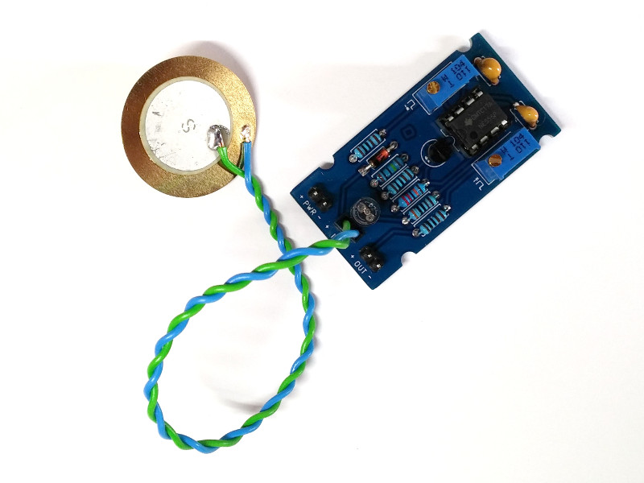
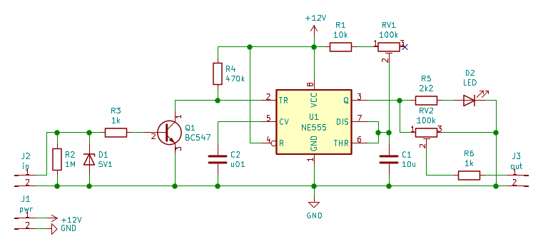

# 555 Piezo Trigger

This trigger module helps to sanitize a sensor input to control sound sources (e.g. drum samples) a bit more precisely.

This circuit uses a 555 timer in monostable mode. It reacts to an input event (in this case a tap on a piezoelectric disc, regardless of specific striking force) by outputting a pulse. This single square pulse is variable in duration and amplitude.

Components listed on the BOM may have to be adapted to fit individual requirements.

Dimensions: 25.4 x 48.26 mm

Mounting hole pattern: 25,4 x 34,93 mm (~3 mm hole diameter)

The PCB files are licensed under a [Creative Commons Attribution-NonCommercial-ShareAlike 4.0 International License](https://creativecommons.org/licenses/by-nc-sa/4.0/).
